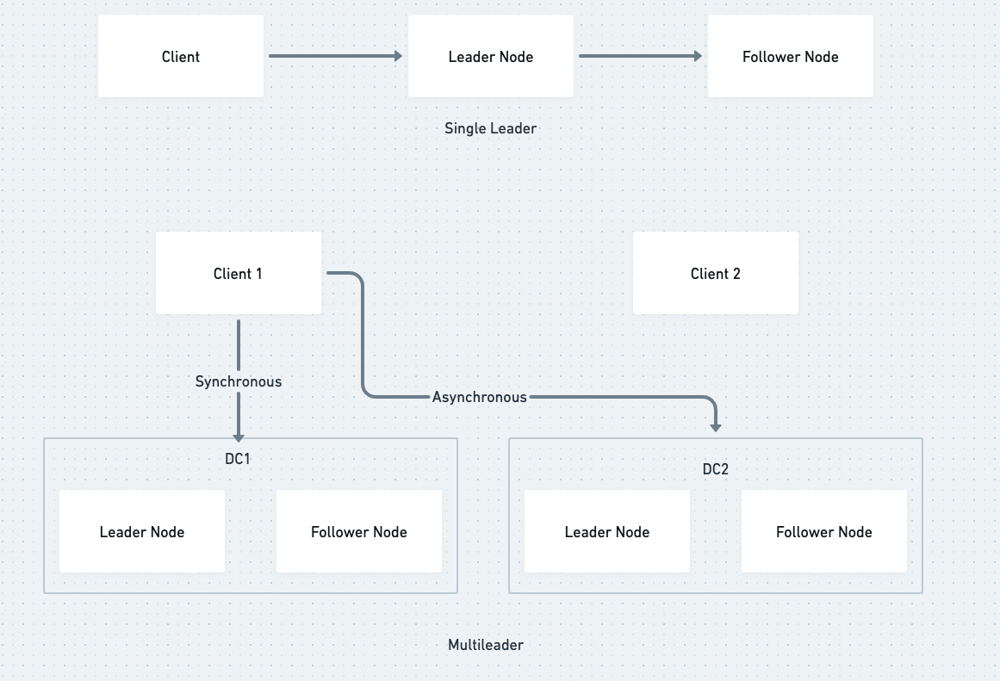
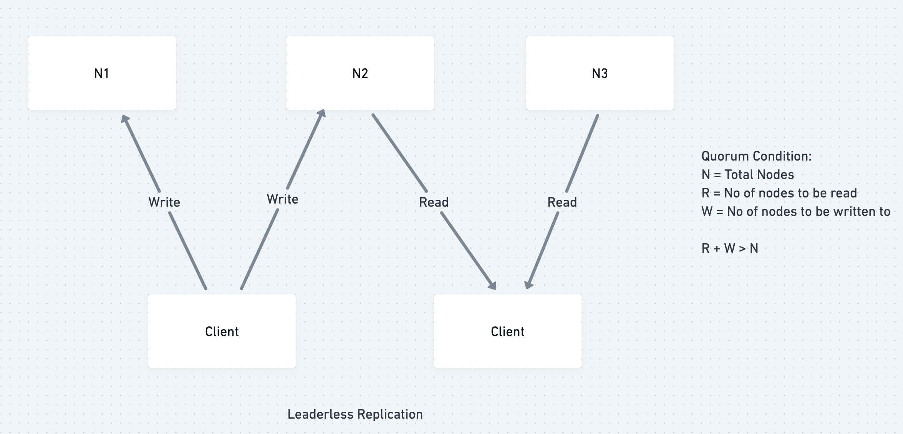

# Key Value Database Design

## Simple database implemented using two bash functions:
```
#!/usr/bin/env bash

db_set (){
    echo "$1, $2" >> database
}

db_get(){
    grep "^$1," database | sed -e "s/^$1,//" | tail -n 1
}
```

- Write cost is O(1), we only append to a file
- Read cost is O(N)

## Define an in-memory Index


- Write cost is O(1) 
- Read cost is O(1)

This approach is used in bitcask the storage engine for Riak

- To avoid running out of disk space the disk files are broken into segments. Once a segment becomes big enough, its sealed and later writes are performed on a different segment file
- Merge and compaction is performed on segments to remove duplicate values 


- Each segment has its own Index file
- During read the key is first searched in the most recent segment and if not found later segments are searched. To improve search performance techniques like bloom filters are used. Bloom filters are probabilistic data strcuture that may produce false positives but never false negatives

**Cons** 
- The Index size is limited by the memory as we keep maintaining each key in the Index. Therefore this approach is suitable for use cases where one has only a few unique keys
- Inefficient range queries

## Maintain sorted segments

The problem of huge index size can be solved if the segments are sorted. This allows us to have a sparse index for a segment e.g. If one has to look for handkerchief, the value can be found between the offsets for handcuffs and handprinted


The segments are called as SSTable(Sorted Strings Table)

How SSTables are formed?
- SSTables are formed using B-Trees
- All incoming writes are performed on an in-memory B-Tree datastructure called memtable
- If memtable becomes two big then its flushed to the disk and a new memtable is used for subsequent writes. This switch operation is atomic
- Immutable segments on disk undergo merge and compaction
- During reads, the search is first performed in the memtable and then in the on-disk segments based on recency order

This approach is used in dabases like DynamoDB, Cassandra

## Availability

A single node is prone to failure. To increase databases replicate data synchronously\asynchronously. There are three popuplar configurations:



1.) Single Leader
- All writes are routed to leader
- When follower fails it uses local logs to recover and requests leader to provide the missing data
- When leader fails, a follower with most upto date changes is promoted as a leader. Getting all followers to agree on a new leader is consensus problem and alogorithms like Paxos and Raft to arrive at consensus
    - Challenges:
        - Client machines have to be reconfigured once leader fails
        - What to do with data that could not get replicated. The most common solution is to discard the data. This could be a problem if other storage systems need to be co-ordinated based on database contents. For example, in one incident at GitHub, an out-of-date MySQL follower was promoted to leader. The database used an autoincrementing counter to assign primary keys to new rows, but because the new leader’s counter lagged behind the old leader’s, it reused some primary keys that were previously assigned by the old leader. These primary keys were also used in a Redis store, so the reuse of primary keys resulted in inconsistency between MySQL and Redis, which caused some private data to be disclosed to the wrong users
        - Split Brain, when a leader is unresponsive for sometime and becomes online again after a follower is promoted as a leader. If both leaders accept right with no process to resolve conflicts, it could lead to data corruption
    - Most failovers are performed manually even when software supports automatic failover
2.) Multi Leader
    - Useful in scenarios when multiple datacenters are used. When one datacenter fails the traffic is routed to the other




3.) Leaderless:
- Used in dynamo style databases
- Work on quoram condition (N > R + W)
    
- Replica Consistency:
    - Read Repair: During reads, if divergence is obseved then the latest value is replicated on all replicase
    - Anti Entropy Process: A background process looks for differences between the replicase and copies missing data from one replica to other. The process uses Merkle trees to identify divergence
    - When N is large and client can connect to some database nodes but not to the ones required to get quoram, some databases allow writing data temporarily to non-quoram nodes to increase availability. When quoram nodes are available the temporary data is sent to the quoram nodes. This is called hinted-handoffs

