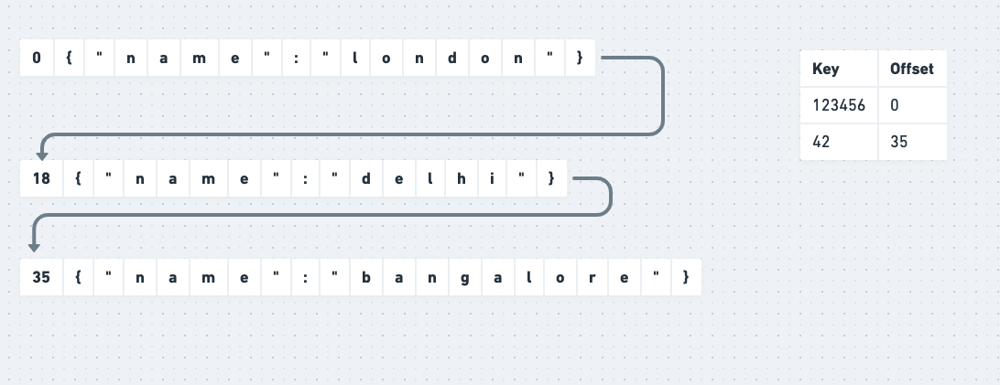
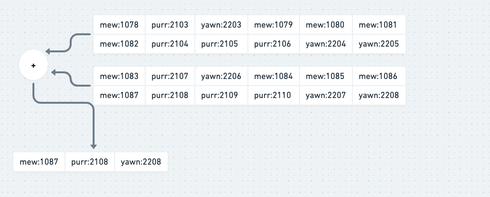
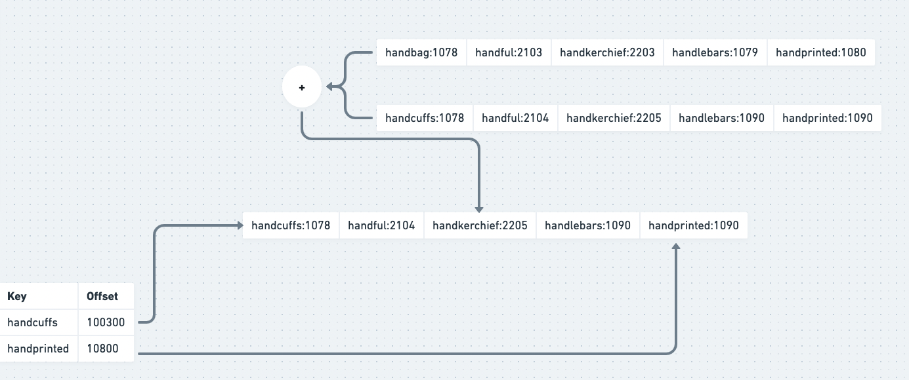

# Key Value Database Design

## Simple database implemented using two bash functions:
```
#!/usr/bin/env bash

db_set (){
    echo "$1, $2" >> database
}

db_get(){
    grep "^$1," database | sed -e "s/^$1,//" | tail -n 1
}
```

- Write cost is O(1), we only append to a file
- Read cost is O(N)

## Define an in-memory Index



- Write cost is O(1) 
- Read cost is O(1)

This approach is used in bitcask the storage engine for Riak

- To avoid running out of disk space the disk files are broken into segments. Once a segment becomes big enough, its sealed and later writes are performed on a different segment file
- Merge and compaction is performed on segments to remove duplicate values 


- Each segment has its own Index file
- During read the key is first searched in the most recent segment and if not found later segments are searched. To improve search performance techniques like bloom filters are used. Bloom filters are probabilistic data strcuture that may produce false positives but never false negatives

**Cons** 
- The Index size is limited by the memory as we keep maintaining each key in the Index. Therefore this approach is suitable for use cases where one has only a few unique keys
- Inefficient range queries

## Maintain sorted segments

The problem of huge index size can be solved if the segments are sorted. This allows us to have ansparse index for a segment e.g. If one has to look for handkerchief, the value can be found between the offsets for handcuffs and handprinted


The segments are called as SSTable(Sorted Strings Table)

How SSTables are formed?
- SSTables are formed using B-Trees
- All incoming writes are performed on an in-memory B-Tree datastructure called memtable
- If memtable becomes two big then its flushed to the disk as an immutable segment where merge and compaction is performed
- During read the value is first searched in the memtable and then in the on-disk segments based on recency order

The segments are called as SSTable(Sorted Strings Table) and in-memory Index are called

This approach is used in dabases like DynamoDB, Cassandra

